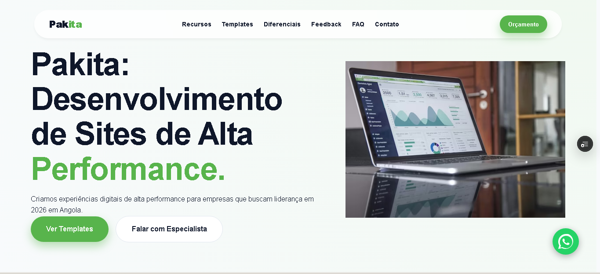

# 🚀 Pakita Excellence - Soluções Digitais

A Pakita Excellence é uma Landing Page de alta performance desenvolvida para o mercado angolano (2026), focada em converter visitantes em leads através de uma experiência de usuário (UX) fluida, design moderno e infraestrutura de ponta.




---

## 🛠️ Tecnologias e Bibliotecas

O projeto foi construído utilizando as melhores ferramentas do ecossistema React:

* **React.js (Vite)**: Framework principal para uma SPA (Single Page Application) ultra-rápida.
* **Framer Motion**: Utilizada para as animações de entrada (reveal) e o contador dinâmico da seção de estatísticas.
* **Lucide React**: Biblioteca de ícones leves e modernos para a interface.
* **Google Analytics (GA4)**: Implementação via `react-ga4` para monitorização de tráfego.
* **SEO Local Core**: Estrutura otimizada com Meta Tags dinâmicas e ficheiros de indexação (`sitemap.xml`, `robots.txt`).

---

## ✨ Funcionalidades

* **Responsividade Premium**: Menu hambúrguer vertical e layouts adaptáveis para todos os ecrãs.
* **WhatsApp Marketing**: Botão flutuante com integração direta para fecho de negócios.
* **Performance Otimizada**: Imagens com lazy loading e scripts otimizados para carregamento em < 1.2s.
* **Gestão de Leads**: Formulário de contacto integrado e funcional.

---

## 💻 Como rodar o projeto localmente

Siga os passos abaixo para configurar o seu ambiente de desenvolvimento:

1.  **Clone o repositório:**
    ```bash
    git clone [https://github.com/seu-usuario/pakita-web.git](https://github.com/seu-usuario/pakita-web.git)
    ```

2.  **Instale as dependências:**
    ```bash
    npm install
    ```

3.  **Inicie o servidor de desenvolvimento:**
    ```bash
    npm run dev
    ```

4.  **Para gerar a versão de produção (Build):**
    ```bash
    npm run build
    ```

---

## 📦 Deploy

O deploy é realizado de forma contínua e automática através da **Vercel CLI**. Para atualizar o site oficial e publicar as alterações em ambiente de produção, utilize o comando:

```bash
vercel --prod